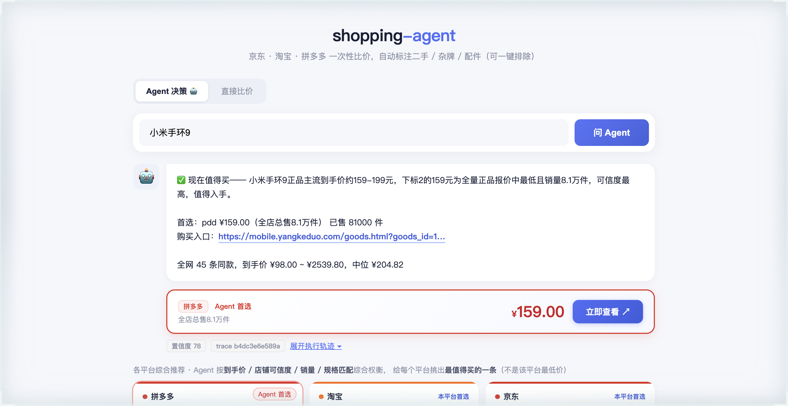
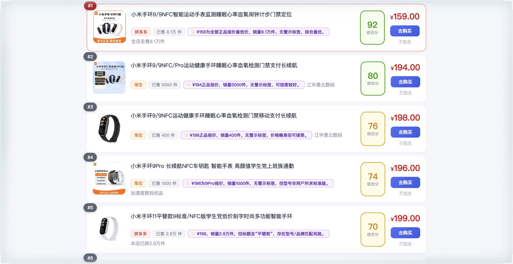
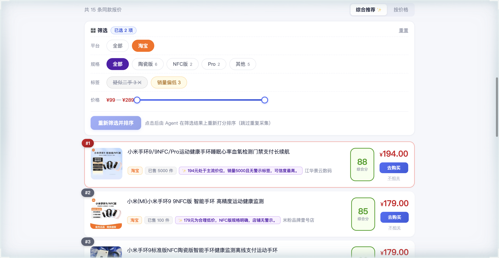
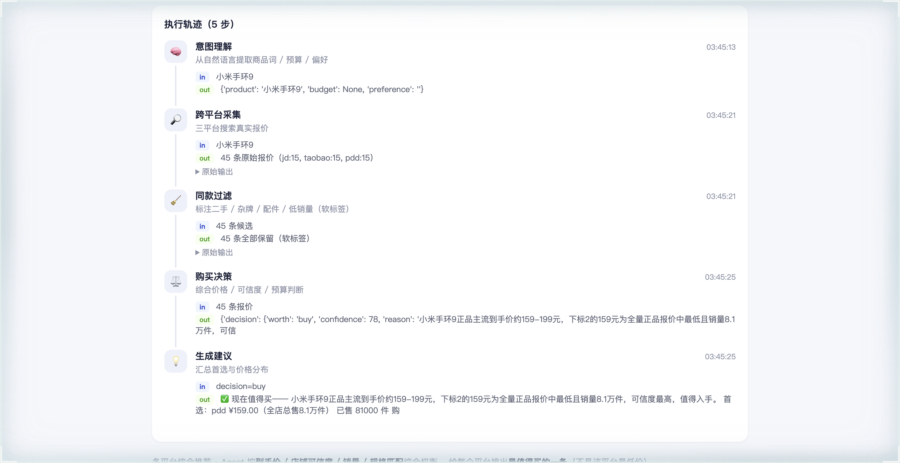
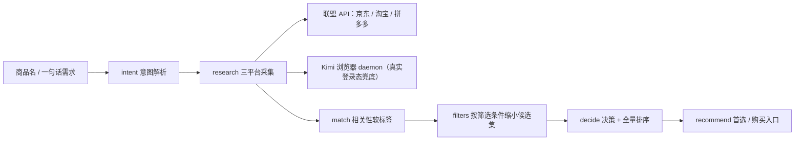

# shopping-agent

[](https://github.com/david-dev666/shopping-agent/actions/workflows/ci.yml)
[](LICENSE)
[](https://www.python.org/)

输入一件商品，自动在京东 / 淘宝 / 拼多多三家问价，算出到手最低价，并给出购买入口。下单的最后一步由人确认。

跨平台比价 + 相关性标注（软标签）+ LangGraph agent 编排已可运行。

## 界面预览

**Agent 决策模式**：一句话需求 → 是否值得买 + 首选 + 各平台最推荐



**报价综合排序**：打标项自动降级，未打标的高销量同款优先



**筛选与重排**：按平台 / 规格 / 标签 / 价格筛选，点「重新筛选并排序」让 Agent 在筛选结果上重新决策



**执行轨迹**：intent → research → match → filters → decide → recommend，每步输入输出与耗时都可回放



## 架构



- **全量链路**：`intent → research → match → filters → decide → recommend`
- **重排链路**：前端筛选面板点「重新筛选并排序」时走 `filters → decide → recommend`，跳过重复采集，直接在缩小后的候选集上重新决策与排序

每一步都写 trace（输入 / 输出 / 耗时），前端「执行轨迹」可完整回放；金额与阈值判断全部由确定性代码完成，LLM 只负责语义与排序。

## 原则

- 不做自动下单、自动支付、自动退款
- 不绕过登录、验证码、访问控制
- 没有授权的数据源返回空结果，不用假数据填充
- 金额与阈值判断用确定性代码完成，不由 LLM 计算

## 与其他方案的区别

- **价格追踪类**（pricebuddy 等）：价格时序扎实，但只盯用户粘贴的单个链接，不做跨平台找同款。
- **AI 导购类**：有 LLM 编排，但不沉淀长期价格数据，本质是一次性搜索问答。
- **本项目**：用采集与存储做底座，自己补一层跨平台**相关性匹配**，再套一层**可观测**的 agent 编排。

## 工作方式

```
搜索词 → 三平台采集 → 相关性标注（二手 / 竞品 / 配件 …）→ 用户筛选 → 综合排序 → 购买入口
```

采集层每个平台一个 adapter，统一输出 `RawOffer`（platform / platform_id / title / price / coupon / url / shop / sales / tags / ts）：

- **官方联盟 API 优先**：京东联盟、淘宝客、多多进宝
- **浏览器采集兜底**：通过 [Kimi 浏览器扩展](https://www.kimi.com/products/kimi-webbridge) 的本地 daemon 驱动用户已登录的浏览器，无需申请任何 API key

匹配层为品牌级确定性规则，命中即打软标签（其他型号 / 其他品牌 / 品牌不明 / 配件 / 疑似二手 / 价格异常 / 销量偏低），**不剔除任何报价**，由前端一键排除；打标项在综合排序中自动让位于未打标报价。规格级同款匹配与置信度评估在路线图阶段 2。

存储使用 SQLite：`offer` 表保存过滤前的全量报价，`crawl_log` 表记录每次抓取的成功 / 失败，便于排查数据缺失。

## 快速开始

```bash
cd backend
uv sync --extra dev
uv run uvicorn app.main:app --port 8000
```

打开 http://127.0.0.1:8000 即可使用。

**想先看效果？** 无需任何 key 或扩展，开 DEMO 模式即可看到上面截图里的完整界面（内置固定样例，页面会显式标注「演示数据」，不与真实采集混用）：

```bash
cd backend
DEMO_MODE=true uv run uvicorn app.main:app --port 8000
```

真实数据来源二选一：

1. **浏览器采集**（默认）：安装 Kimi 浏览器扩展，在浏览器中登录京东 / 淘宝 / 拼多多
2. **官方联盟 API**：在 `backend/.env` 中填入各平台 key（参考 `backend/.env.example`），配置后优先于浏览器采集

> `docker-compose.yml` 只起一个 Postgres，用于把 `DATABASE_URL` 从 SQLite 切过去（需 `uv sync --extra postgres` 装驱动），默认无需启动。

## 评测与性能

- **相关性标注**：自建 36 条标注集上，规则层 micro F1 **0.96**（`cd backend && uv run python scripts/eval_rules.py`）
- **端到端**：一次 `POST /api/chat` 本机约 **15 s**（三平台采集 ≈11 s + LLM 决策 ≈3.7 s），每步耗时在 trace 中可见

口径、脚本与局限见 [docs/04-metrics.md](docs/04-metrics.md)。

## 状态与路线图

- ✅ 三平台采集（联盟 API 优先 + Kimi 浏览器 daemon 兜底）
- ✅ 相关性软标签 + 综合排序（打标项自动降级，LLM 看到标签自行降权）
- ✅ LangGraph 六节点编排 + 全流程 trace 回放
- ✅ 筛选面板：客户端即时过滤 + 「重新筛选并排序」触发 agent 在缩小后的候选集上重新决策（`/api/refine`，跳过重复采集）
- 🚧 规格级同款匹配与置信度评估
- 📋 价格历史曲线、目标价盯价提醒

完整路线图见 [docs/03-roadmap.md](docs/03-roadmap.md)。

## 技术栈

| 层 | 选型 |
|---|---|
| 后端 | FastAPI + Pydantic |
| 编排 | LangGraph |
| 采集 | httpx（联盟 API）+ Kimi 浏览器扩展 daemon |
| 存储 | SQLite，正式版 Postgres |
| 前端 | 单文件 HTML 演示页，正式版 Next.js |

## 项目结构

```
shopping-agent/
├── docs/                     设计文档与截图
├── backend/
│   ├── app/
│   │   ├── api/              HTTP 接口
│   │   ├── adapters/         平台采集适配器
│   │   ├── matching/         相关性标注（软标签）+ 筛选
│   │   ├── models/           数据模型
│   │   ├── agents/           LangGraph 编排（双入口）
│   │   ├── demo/             DEMO_MODE 内置样例
│   │   └── storage/          持久化
│   ├── eval/                 规则层标注集与评测
│   ├── scripts/              评测 / 采集耗时脚本
│   ├── migrations/           alembic 迁移
│   ├── static/               演示页
│   ├── tests/
│   └── .env.example
└── docker-compose.yml
```

## 开发

```bash
cd backend
uv run pytest -q                              # 单元测试 + 评测集守卫
uv run ruff check app tests scripts eval migrations   # lint
uv run python scripts/eval_rules.py           # 规则层评测
uv run python scripts/bench_crawl.py 小米手环9 # 采集耗时
uv run alembic upgrade head                   # 版本化建表（默认启动已自动 create_all）
```

接口自带 Swagger 文档：启动后访问 http://127.0.0.1:8000/docs 。

## 文档

1. [docs/00-overview.md](docs/00-overview.md) 项目定位
2. [docs/01-landscape.md](docs/01-landscape.md) 竞品调研
3. [docs/02-architecture.md](docs/02-architecture.md) 架构设计
4. [docs/03-roadmap.md](docs/03-roadmap.md) 路线图
5. [docs/architecture.html](docs/architecture.html) Agent 架构说明（可视化网页）
6. [docs/04-metrics.md](docs/04-metrics.md) 准确率与耗时

## 已知限制

- 浏览器采集依赖本机的 Kimi 浏览器扩展与平台登录态，可能触发平台风控 / 验证码（触发后不绕过，提示人工完成）
- 相关性为品牌级确定性规则：跨品牌同款、规格级对齐尚未实现，误判案例见 [docs/04-metrics.md](docs/04-metrics.md)
- 目前无价格历史沉淀，比价是「当前时点」的快照

## 开源许可

本项目基于 [MIT License](LICENSE) 开源。

采集层的浏览器方案依赖 [Kimi 浏览器扩展（Kimi WebBridge）](https://www.kimi.com/products/kimi-webbridge) 的本地 daemon，感谢其开源工作。
